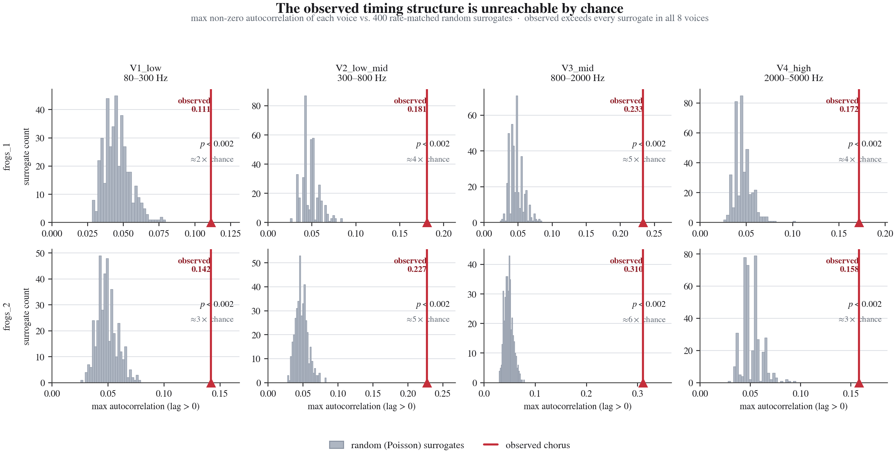
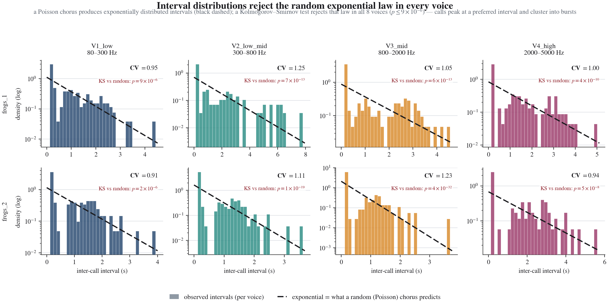
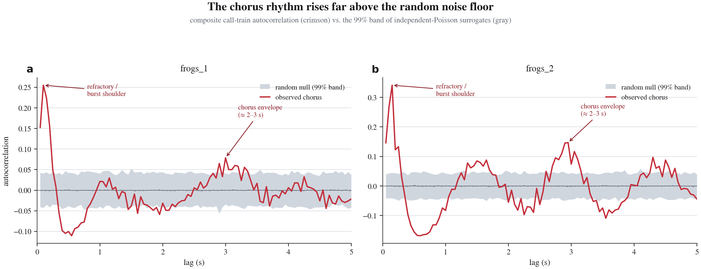
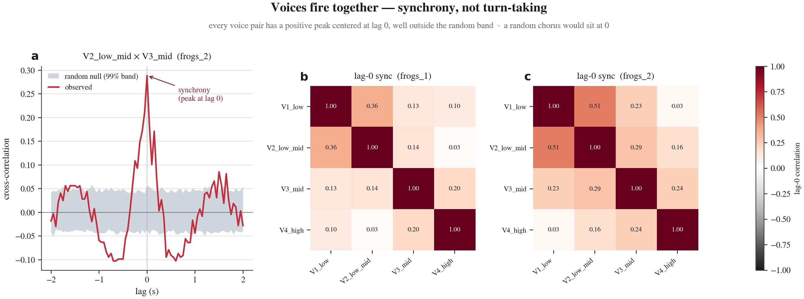

# Visual Proof — Random vs. Observed

The claim from [`RESULTS.md`](RESULTS.md) is statistical: the frog chorus is
**not random**. These figures make that claim *visible*. Every panel uses one
fixed visual grammar so the contrast reads at a glance:

> **gray = what randomness predicts** (an independent Poisson chorus, H0)
> **crimson = what the frogs actually do** (the measured signal)

Generated by [`scripts/make_figures.py`](scripts/make_figures.py) from the same
onset data and the same seeded surrogate machinery as the analysis, so the
pictures cannot drift from the numbers. Regenerate with:

```
cd /Users/drew/soundtemple
.venv/bin/python frogs/scripts/make_figures.py
```

---

## Figure 1 — What random looks like vs. what the frogs do


**The whole argument in one picture.** Both columns contain the *same number of
calls* in the *same four frequency-band voices* over a 50-second window. The
only difference is the timing.

- **(a) Left — H0 (random):** each voice's calls are scattered uniformly at
  random (an independent Poisson process at the voice's measured rate). The
  ticks are evenly spread; the population call-rate **(c)** wanders around a
  constant with no shape.
- **(b) Right — observed:** the real recording. Calls collapse into **vertical
  bands** — moments when every voice fires together — separated by near-silence.
  The population rate **(d)** swings between loud bursts and quiet gaps on a
  shared ≈ 2–3 second envelope.

A random chorus is a flat texture. The real chorus breathes. *(The companion
[`fig1_random_vs_observed__frogs_2.png`](figures/fig1_random_vs_observed__frogs_2.png)
shows the second recording.)*

---

## Figure 2 — The observed structure is unreachable by chance



**The formal test behind Figure 1.** For each of the 8 voices we measure one
number — the strongest non-zero peak of the call-train autocorrelation, i.e.
"how rhythmic is this voice" — and compare it to 400 rate-matched **random
(Poisson) surrogates** (gray). The observed value (crimson) lands far to the
right of every surrogate, roughly **2–6× the chance baseline**, in all 8
voices. None of 500 surrogates in the full analysis reached the observed peak,
so **p < 0.002 everywhere**. This is the headline result: the rhythm we see is
not something randomness produces.

---

## Figure 3 — Intervals reject the random exponential law



**A second, independent line of evidence.** A Poisson (random) chorus produces
*exponentially* distributed inter-call intervals — a smooth monotonic decay
(black dashed). The observed intervals (colored bars, log scale) refuse to
follow it: they peak at a **preferred interval** and carry a **heavy tail** of
long silences between bursts. A Kolmogorov–Smirnov test rejects the exponential
in **every one of the 8 voices** (p ≤ 9×10⁻⁶). Coefficients of variation drift
from the random value of 1 (CV ≈ 0.9 for the regular low voices, up to 1.25 for
the burstiest), but the distribution *shape* is the decisive break.

---

## Figure 4 — Chorus rhythm rises above the noise floor



**Where the structure lives in time.** The composite call-train autocorrelation
(crimson) is plotted against the 99% confidence band of independent-Poisson
surrogates (gray). A random chorus stays pinned inside the thin gray band at
zero. The real chorus punches through it twice: a sharp **refractory / burst
shoulder** at short lag, and a broad **≈ 2–3 second chorus envelope** — the same
shared rhythm visible in Figure 1(d).

---

## Figure 5 — Voices fire together: synchrony, not turn-taking



**How the voices relate to one another.** A communication-by-alternation story
would predict turn-taking (voices anti-correlated — one on while another is
off). Instead, **(a)** the cross-correlation of a representative voice pair has
a strong positive peak centered at **lag 0**, well outside the random band, and
**(b, c)** every voice pair in both recordings is positively correlated at lag 0
(all cells red; a random chorus would sit near 0 / gray). The band of frogs
cycles between "all calling" and "all silent" *in phase*.

---

### What the pictures do and do not prove

Figures 1–5 establish the **necessary precondition** for the
entropy-reduction-as-communication hypothesis: the chorus is decisively
non-random and collectively self-organized in time. They do **not** by
themselves separate that account from shared external entrainment, a
chorus-leader effect, or a sexual-selection rhythm preference — see
[`RESULTS.md` §4–5](RESULTS.md) for the honest limits and the playback /
disturbance experiments that would disambiguate.
