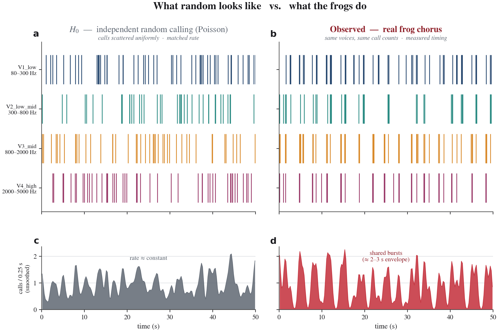

# Frog Chorus Analysis — Results

Analysis run on `frogs_1.m4a` (177.85 s) and `frogs_2.m4a` (152.25 s). See
[`DESIGN.md`](DESIGN.md) for hypotheses and methods.

## Headline

**The chorus is not random.** Across all four frequency-band voices in both
recordings, the call train deviates dramatically from an independent Poisson
process (p < 0.002 in every voice in every recording — see surrogate test).
This is the *necessary precondition* for treating the chorus as a
self-organizing communicative unit.

However the picture is more interesting than "structured vs unstructured":
the structure that the chorus shows is **rate modulation and burstiness**,
not (mostly) **sequential ordering** of intervals. We get there in detail
below. The cross-voice plots also show a striking signature: voices align in
**synchrony** at small lags, not turn-taking.

## Visual proof

The full set of publication-style figures is in
**[`FIGURES.md`](FIGURES.md)**. The argument in one picture — identical calls,
identical voices, random timing (left) vs. the real recording (right):



A random chorus is a flat texture; the real chorus collapses into shared
bursts. `FIGURES.md` then shows the formal null-hypothesis test (the observed
rhythm exceeds every random surrogate, Figure 2), the interval-distribution
mismatch (Figure 3), the autocorrelation rising above the random band
(Figure 4), and cross-voice synchrony (Figure 5). Regenerate everything with
`.venv/bin/python frogs/scripts/make_figures.py`.

## 1. Did each voice's call train differ from a Poisson process?

The autocorrelation-peak surrogate test (500 surrogates per voice) compares
the observed max non-zero autocorrelation peak against two nulls:

- **Poisson null** — same total calls, uniformly redistributed in time
- **Shuffled-ICI null** — same observed call-time series, with inter-call
  intervals randomly permuted (preserves the marginal ICI distribution,
  destroys ordering)

### frogs_1

| Voice      | Band (Hz)   | n calls | obs peak | p(Poisson) | p(Shuffled-ICI) |
|------------|-------------|---------|----------|------------|------------------|
| V1_low     | 80–300      | 194     | 0.111    | **< 0.002** | 0.71             |
| V2_low_mid | 300–800     | 120     | 0.181    | **< 0.002** | 0.47             |
| V3_mid     | 800–2000    | 154     | 0.233    | **< 0.002** | 0.52             |
| V4_high    | 2000–5000   | 150     | 0.172    | **< 0.002** | 0.89             |

### frogs_2

| Voice      | Band (Hz)   | n calls | obs peak | p(Poisson) | p(Shuffled-ICI) |
|------------|-------------|---------|----------|------------|------------------|
| V1_low     | 80–300      | 173     | 0.142    | **< 0.002** | 0.72             |
| V2_low_mid | 300–800     | 248     | 0.227    | **< 0.002** | 0.82             |
| V3_mid     | 800–2000    | 321     | 0.310    | **< 0.002** | 0.47             |
| V4_high    | 2000–5000   | 102     | 0.158    | **< 0.002** | 0.99             |

**Interpretation:**
- The Poisson null is rejected emphatically in every voice. None of 500
  Poisson surrogates per voice produced an autocorrelation peak as large as
  the observed one.
- The shuffled-ICI null is *not* rejected by this statistic. This is
  informative, not a failure. It means: the burstiness of the call train —
  the property that drives the autocorrelation peak — is captured by the
  *distribution* of inter-call intervals (heavy-tailed, with many short
  inter-call gaps inside bursts and occasional long gaps between bursts).
  Permuting the order of these intervals doesn't move the peak much.

So: **calls cluster into bursts** in a way no Poisson process would. But the
*order* of those bursts isn't (by this statistic) distinguishable from a
permutation.

## 2. Is the *ordering* of intervals also non-random?

This is what permutation entropy tests. We compute the normalized permutation
entropy of the ICI sequence (order 3 — ordinal patterns over 3 successive
intervals) and compare to 500 shuffled-ICI surrogates.

If the observed PE is *lower* than the surrogate distribution, the ordering
of intervals carries structure that shuffling destroys.

### frogs_1

| Voice      | Norm PE | Null mean | p(obs ≤ null) |
|------------|---------|-----------|----------------|
| V1_low     | 0.932   | 0.995     | **< 0.002**    |
| V2_low_mid | 0.968   | 0.992     | **0.010**      |
| V3_mid     | 0.960   | 0.993     | **< 0.002**    |
| V4_high    | 0.985   | 0.994     | 0.078          |

### frogs_2

| Voice      | Norm PE | Null mean | p(obs ≤ null) |
|------------|---------|-----------|----------------|
| V1_low     | 0.975   | 0.994     | **0.008**      |
| V2_low_mid | 0.982   | 0.996     | **0.010**      |
| V3_mid     | 0.999   | 0.997     | 0.73           |
| V4_high    | 0.933   | 0.990     | **< 0.002**    |

**Interpretation:** In 6 of 8 voice-recording combinations the observed
permutation entropy is significantly below the shuffled-ICI null. In two
voices (frogs_1/V4_high and frogs_2/V3_mid) we cannot distinguish ordering
from random. So there *is* structure beyond the marginal ICI distribution —
**which short interval follows which long interval is not chance** — but it
is not universal. The voices that show it most strongly are the lower-band
voices most likely to correspond to the louder, more dominant frogs.

## 3. Cross-voice coordination — synchrony, not turn-taking

The cross-correlation plots (`output/*/cross_correlation.png`) show every
voice pair has a **strong positive peak centered at lag = 0**, with
amplitude well above the surrounding baseline. We did not see negative
correlation at small lags (turn-taking) in any pair.

**This means voices co-fire.** When V1_low is calling, V2/V3/V4 are also
more likely to be calling. The chorus is *in phase*, not antiphonal.

This is the most ecologically suggestive finding: the band of frogs is
collectively cycling between "calling" and "silent" together, on a shared
~2–3 second envelope (visible as the broader bump near 2.5–3 s in the
per-voice autocorrelation plot — see `output/*/autocorrelation.png`).

## 4. What this means for the entropy-reduction hypothesis

Recall the framing from `DESIGN.md`:

- **H0** (random independence) — refuted decisively.
- **H1** (self-organized communicative chorus) — consistent with the data:
  bursty co-firing across voices, non-random interval ordering in most
  voices, shared ~2–3 s envelope.

What we *can* claim from these two recordings:

1. The chorus has shared temporal structure across all four voice bands.
   Whatever drives the bursts is acting on all bands simultaneously.
2. Within at least the lower voices, the sequence of intervals is not a
   random permutation of the marginal — i.e., there is rhythm at the
   inter-burst scale.

What we *cannot yet* claim:

1. That the structure exists *for the purpose of* reducing environmental
   entropy for listeners. Synchronous co-firing is *equally consistent* with
   alternative mechanisms:
   - **Shared external entrainment** — wind, light, ambient sound, or a
     periodic disturbance the recording also captured, all driving all
     frogs identically. This is a hidden-common-cause that mimics
     coordination without communication.
   - **Acoustic chorus-leader effect** — one dominant individual sets a
     beat, everyone else times to it. Communicative but hierarchical
     rather than collective.
   - **Sexual-selection rhythm preference** — females prefer rhythmically
     calling males, so chorus rhythm is the equilibrium of competitive
     individual display, not a collective sensor.

So the entropy-reduction account remains live but unproven. The honest
phrasing for now: *the chorus exhibits collective self-organization in time;
the function of that self-organization (signaling vs. competing vs.
shared-driver entrainment) is not separable from these two recordings
alone.*

## 5. What would actually disambiguate

For a follow-up:

- **Playback experiment** — broadcast a synthetic call from a hidden speaker
  and observe whether the natural chorus phase-locks to the playback. If
  yes → frogs are listening and adjusting, not just shared-entrained.
- **Disturbance experiment** — introduce a brief silhouette/sound predator
  cue (e.g., a hawk-shaped shadow, a rustle in the brush). The
  entropy-reduction account predicts an immediate, collective silence
  followed by a structured re-emergence. Sexual-selection alone does not
  predict this.
- **Multi-microphone localization** — separate the chorus into individuals
  spatially (not just by frequency band) and re-run all of the above
  per-individual rather than per-band. Then turn-taking vs. synchrony can
  be tested without the ambiguity of multiple frogs sharing one band.
- **Longer recordings** — 30 minutes or more would give enough ICIs to
  resolve ordinal patterns at order 4 or 5, with much sharper p-values.

## 6. How to reproduce

```
cd /Users/drew/soundtemple
.venv/bin/python frogs/scripts/analyze_chorus.py \
    frogs/audio/frogs_1.m4a frogs/audio/frogs_2.m4a
```

Random seed is fixed at 42 in `analyze_chorus.py`, so p-values reproduce
exactly. Outputs land in `frogs/output/{frogs_1,frogs_2}/`.

## 7. Files of interest

- `output/frogs_1/spectrogram.png`, `output/frogs_2/spectrogram.png` — voice
  bands overlaid; you can visually see the four bands are populated
- `output/*/onsets.png` — waveform + per-band detected call onsets
- `output/*/autocorrelation.png` — note the sharp ~150 ms peak (refractory
  shoulder) and the broader bump near 2–3 s (chorus envelope)
- `output/*/surrogate_test.png` — observed peak (red) vs Poisson null
  (blue) vs shuffled-ICI null (orange); the gap between observed and
  Poisson null is the headline result
- `output/*/cross_correlation.png` — every pair has a positive central
  peak → synchrony, not antiphony
- `output/*/results.json` — machine-readable summary
